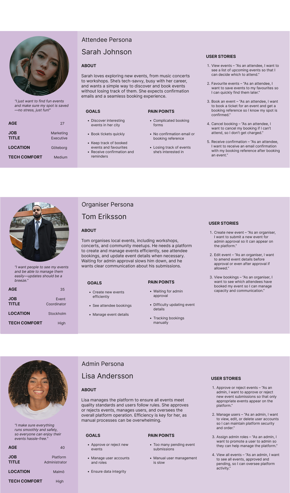

# Event Booker

## Hi! This is my exam project for Advanced JavaScript.

I’m building an event booking application from scratch that will cover:

- UX research & design – planning user flows and wireframes before development.

- Full backend functionality – built with Node.js, Express, and MongoDB, including authentication, data models, and a REST API.

- Frontend – built with React, connected to the backend for browsing, booking, and managing events.

- Admin features – approve/reject events, manage users, and view event statistics.

- Organiser workflow – create and edit events, including handling admin feedback (“needs update”) before events are approved.

This project is a work in progress – I’ll be updating the repo as I go.

🚀 Check out the deployed version here: [Eventure Live](https://eventure-events.netlify.app/)

Thanks for dropping by! 🙌

## Endpoints  

<a href="./assets/endpoints.png" target="_blank">View Endpoints</a>

|                                 |        |                                                  |       |
|---------------------------------|--------|--------------------------------------------------|-------|
| Action                          | Method | URL                                              | Notes |
| Test server                     | GET	   | http://localhost:5050/                           |  Returns server status     |
| AUTH                            |        |                                                  |               |
| Register	                      | POST   | http://localhost:5050/auth/register              | Creates a user. Organiser registrations become “pending” until admin approval. |
| Login	                          | POST   | http://localhost:5050/auth/login                 | Returns JWT token and user info. Pending organisers log in as attendee until approved.|
| Logout                          | POST   | http://localhost:5050/auth/logout                | Clears authentication token.|
| DASHBOARDS (protected)          |        |                                                      ||
| User Dashboard                  | GET	   | http://localhost:5050/user-dashboard             | requires attendee, organiser or admin |
| Organiser Dashboard             | GET	   | http://localhost:5050/organiser-dashboard        | organiser only|
| Admin Dashboard                 | GET	   | http://localhost:5050//admin-dashboard           | admin only |
| EVENTS (public)                 |        |                                                  |               |
| List all events                 | GET	   | http://localhost:5050/event                      | supports ?status and ?category query filters |
| Single event                    | GET    | http://localhost:5050/event/:eventId             | get one by ID |
| List categories                 | GET    | http://localhost:5050/event/categories           | returns distinct event catergories |
| USER / ATTENDEE (protected)     |        |                                                  |               |
| Get current user profile        | GET	   | http://localhost:5050/users/me                   | returns user info with favourites and booked events |
| Save event to favourites        | POST   | http://localhost:5050/users/favorites/:id        | adds an events to favourites |
| Remove event to favourites      | DELETE | http://localhost:5050/users/favorites/:eventId   | removes an events from favourites |
| Book an event                   | POST   | http://localhost:5050/users/bookings/:eventId    | booked an event (adds to user.bookedEvents & send conf email) |
| Cancel an event                 | DELETE | http://localhost:5050/users/bookings/:bookingId  | cancels an exisitng booking |
| ORGANISER ONLY (protected)      |        |                                                  |               |
| Create new event          	  | POST   | http://localhost:5050/organiser/events           | Organiser (or admin) creates new event. Auto pending status until approved |
| List organiser's events         |	GET    | http://localhost:5050/organiser/events           | Returns organiser’s own events (filter by ?status= optional). |
| Edit existing event             |	PUT    | http://localhost:5050/organiser/events/:id       | Updates an event and sets status to “pending” for re-approval. |
| Cancel event           	      | DELETE | http://localhost:5050/organiser/events/:id       | Soft delete: sets status “cancelled”, notifies attendees and admins. |
| ADMIN ONLY (protected)          |        |                                                  |               |
| Get all users    	              | GET	   | http://localhost:5050/admin/users                | Lists all users (excludes passwords). |
| Create admin user	              | POST   | http://localhost:5050/admin/users                | Admin creates a new user (any role). |
| Update user info	              | PUT    | http://localhost:5050/admin/users/:id            | Admin can update user's details |
| Delete user                     |	DELETE | http://localhost:5050/admin/users/:id            | Admin deletes user |
| Approve organiser request       |	PATCH  | http://localhost:5050/admin/approve-organiser/:id            | Approves pending organiser and updates role to “organiser”. |
| Get all events / stats          | GET    | http://localhost:5050/admin/events               | Returns event list + analytics (approved, pending, cancelled, etc.).    |
| Approve / reject event (admin)  |	POST   | http://localhost:5050/admin/events/:id/approve   | action in body: "approve", "needs-update", "reject" (optionally add comment). |

# Flow Chart

<a href="./assets/Event-Booker.png" target=" blank">Flow Chart for full functions</a>

# Persona and UX Research

<!--  -->
<a href="./assets/Personas.png" target="_blank">View Personas</a>

<a href="./assets/UserResearch.pdf" target="_blank">View User Research</a>

# Features Added Recently

- Admin dashboard improvements:

    - Approve, reject, or request updates for pending events.

    - Track events that need amendments and notify organisers.

    - View event statistics for better insights.

    - Full user management (create/update/delete users, including admin roles).

- Organiser workflow enhancements:

    - Create new events with categories, dates, times, and prices.

    - Edit events after admin requests changes.

    - Receive “needs update” comments and amend events accordingly.

- Frontend improvements:

    - Protected routes based on role (attendee, organiser, admin).

    - Dynamic forms for event creation with category suggestions.

    - Real-time updates to event lists after admin actions.
